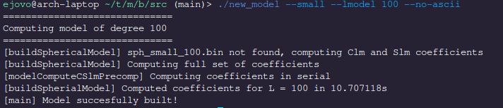
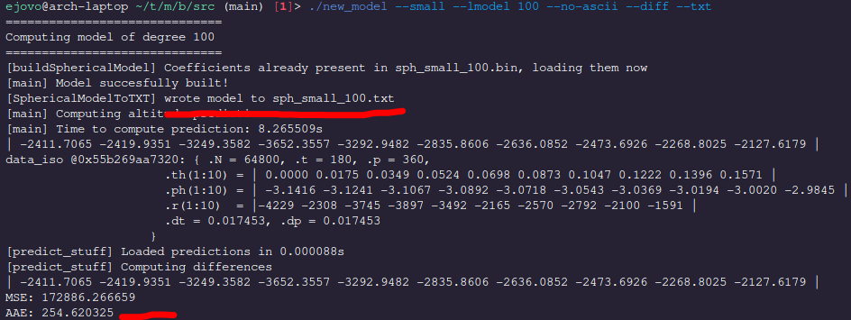
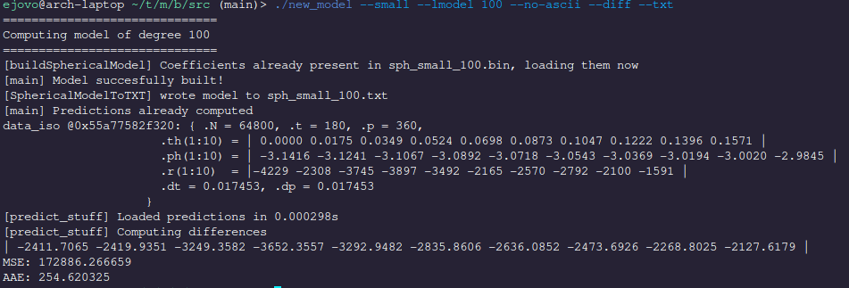
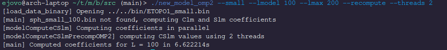
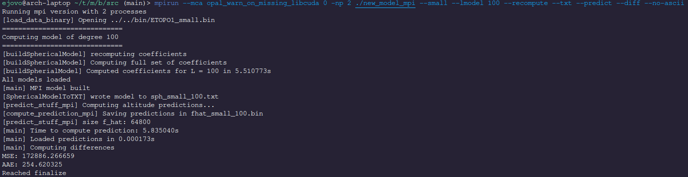
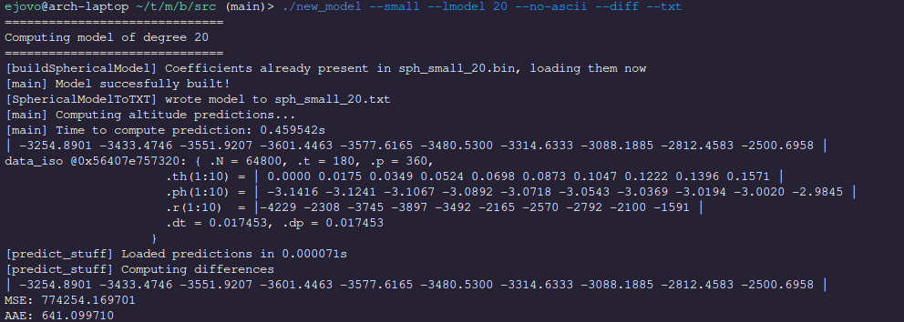
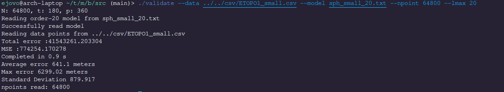

# Geodesy

Modelling the earth with Spherical Harmonic functions

### Goals

Compute a model with the lowest average error

| | | |
| --- | --- | --- |
| |  |  |

### Building

Geodesy is built with CMake
```
mkdir build && cd build
cmake ../ -DCMAKE_BUILD_TYPE=Release
cmake --build ./
```

### Executables

There are three main executables (among others) that are created by this project, located in `build/src`. `new_model`, `new_model_mpi`, and `new_model_omp2` are 3 different implementations of the Numerical Quadrature algorithm to approximate the Laplace Series coefficients of a NASA data set. The CLI is similar to the model that was provided to us, which is now located in `old_model`.

#### `new_model`
New model computes the Laplace series coefficients up to a certain degree l via numerical quadrature. The binary data sets are provided in the `bin/` directory of geodesy's root folder and unfortunately the paths are hardcoded: therefore we must execute `new_model` from the `/build/src` directory.

```
./new_model --small --lmodel 100
```



The coefficients are then stored in the file `sph_small_100.bin` of the current working directory. To validate the model and extract the coefficients into a text file, we can add the parameters `--diff` and `--txt`.

```
./new_model --small --lmodel 100 --txt --diff
```



The Laplace series coefficients are outputted to `sph_small_100.txt` in the same format that the `old_model` provides. The Average Absolute Error (AAE) and the Mean Squared Error (MSE) are printed at the bottom of the screen. Furthermore, notice that since the coefficients were stored in a binary file we don't need to recompute them. Similarly, the predictions have been stored in a binary format and don't need to be recomputed on subsequent computations.

Rerunning
```
./new_model --small --lmodel 100 --txt --diff
```

completes almost instantly



If you would like to recompute values then we pass the parameter `--recompute`

#### `new_model_omp2`
Model using numerical quadrature that is parallelized with omp. `new_model_omp` tries to parallize the internal integration loop whereas `new_model_omp2` parallelizes the loop that computes (l + 1)(l + 2) coefficients. We can compute a model in a nearly identical fashion as `new_model` but this time we specify the number of threads with the `--threads` flag.

```
./new_model_omp2 --small --lmodel 100 --lmax 200 --recompute --threads 2
```

`new_model_omp2` uses an older version of the command line interface so we have to specify the degree of the precomputed Associated Legendre Polynomials with `--lmax`.



Notice that with two threads the runtime of computing a model of degree 100 is nearly two times faster than with only one thread.

#### `new_model_mpi`
Uses MPI routines to parallelize the computation of Laplace series coefficients.

```
mpirun --mca opal_warn_on_missing_libcuda 0 -np 2 ./new_model_mpi --small --lmodel 100 --recompute --txt --predict --diff --no-ascii
```



The AAE printed at the bottom is exactly the same as for `new_model` and `new_model_2` which confirms that the coefficients computed are consistent across different implementations. 

### Validation

To confirm that the AAE computed by our program is exactly the same as by the original `validate` program, let's compute a degree 20 model.

```
./new_model --small --lmodel 20 --no-ascii --diff --txt
```



Which computes a model whose AAE is 641.1. We can use the old model's validation program `validate` to verify that our validation results are consistent with the provided implementation.

```
./validate --data ../../csv/ETOPO1_small.csv --model sph_small_20.txt --npoint 64800 --lmax 20
```



Indeed, the Average error computed by `validate` is 641.1 and therefore we are confident with the validation of our programs `new_model`, `new_model_omp2`, and `new_model_mpi`.